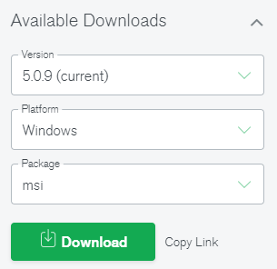
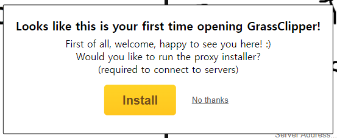
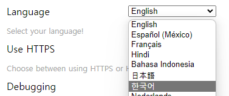
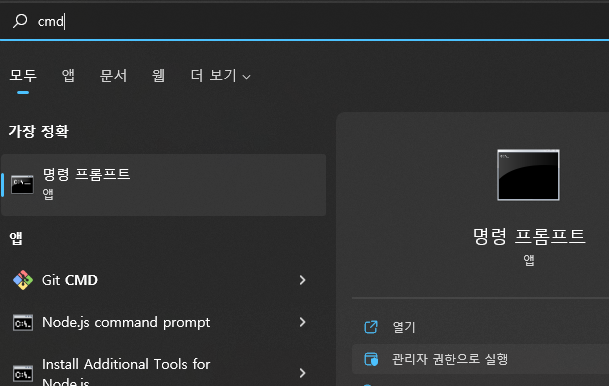
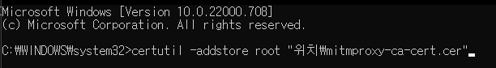
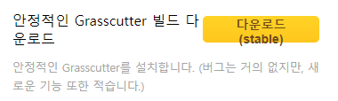
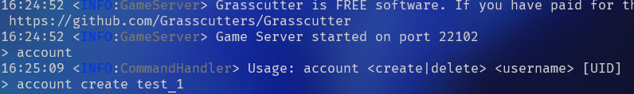
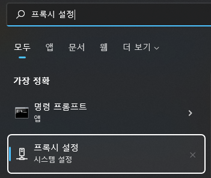

> **Note**
> 
> `3.x`+ 버전 또한 해당 방법 (`GrassClipper`에서 설치)으로 사설 서버를 구축할 수 있습니다.
> 
> **해당 가이드는 더이상 업데이트 되지 않습니다.**

# Grasscutter 사설 서버 (커스텀, 테스트 서버) 설치 가이드 (2.8 기준)

* [준비물](#준비물)
* [설치](#설치)
  * [1](#1)
  * [2](#2)
* [실행](#실행)
* [명령어](#명령어)
* [기타](#기타)


> **모드([모델 변경](https://github.com/portra400nc/ModelChanger), [카메라](https://github.com/portra400nc/CameraTools) 툴 등) 사용는 `melonloader`를 사용해야 하지만, `2.7`, `2.8`을 지원하지 않습니다. `2.6`으로 다운그레이드하여 모드를 사용할 수 있습니다.** (또는 직접 수정하여)

<br>

---

> **윈도우를 기준으로 설명합니다.**
> 
> 궁금한 점이나 오류는 이슈를 오픈해주세요.

<br>

---

# 준비물

- [**Java 17**](https://www.oracle.com/java/technologies/javase/jdk17-archive-downloads.html)

- [**MongoDB (버전 4.0 이상)**](https://www.mongodb.com/try/download/community)
  - 

- [**GrassClipper**](https://github.com/Grasscutters/GrassClipper/releases/tag/v0.9.10)
  - 

# 설치

## 1

다운받은 **GrassClipper.zip** 압축을 푼 다음, `GrassClipper.exe` (확장자를 표시하지 않는 경우 `GrassClipper` 파일)을 실행합니다.

처음 실행하게 되면 다음과 같은 화면이 나옵니다.



`Install`을 클릭하여 프록시를 설치해주세요.

> 설치하는 동안 `GrassClipper`의 언어를 바꿔봅시다.
>
> 타이틀 메뉴의 톱니바퀴를 클릭한 후, 아래와 같이 언어를 선택합니다.
>
> 

<br>

---

아래와 같은 메세지가 출력된다면,

```sh
============================================================================================================
!! Certificate install failed !!

Please manually run this command as Administrator:
                        certutil -addstore root "위치\mitmproxy-ca-cert.cer"
============================================================================================================
```

명령 프롬프트를 관리자 권한으로 실행한 후,



위 메세지에 있는 명령어를 입력합니다.



---

## 2


`게임 실행파일 설정`을 클릭하여, 게임의 실행 파일을 선택합니다.

> [실행파일 찾기](genshin_path.md)

<br>

---

이제 2.7 데이터를 받아야 합니다.

아래의 링크를 클릭하여, 다운로드 해주세요. (압축 해제는 `7zip`이 빠릅니다.)

[구글 드라이브](https://drive.google.com/file/d/1EZ13D8U_zFBqm50tSxXlrdF0kJeuwWLX/view?usp=sharing)

압축 해제 후, `gc2.7` 폴더를 `GrassClipper.exe`가 위치한 폴더에 복사해주세요.

> ^ 2.8의 경우엔, `gc2.7/Resources` 폴더에 https://github.com/Dimbreath/GenshinData 해당 폴더 및 파일을 복사해주세요.
> 
> 또는 grasscutter 데이터 & 리소스 업데이트
> 
> * 참고: [#1](https://github.com/ky0422/genshin-custom-server/issues/2#issuecomment-1186179818)

<br>

GrassClipper로 와서, 톱니바퀴를 클릭한 뒤, 아래와 같은 버튼을 클릭합니다.



클릭 후, 조금 기다리면 검은 창이 뜰텐데
바로 종료하신 후, 아래의 버튼을 클릭합니다.


클릭 후, `GrassClipper.exe`가 위치한 폴더로 이동 후, `gc2.7`을 클릭합니다.

그리고 `grasscutter-1.1.2-dev.jar`을 선택해주세요.

<br>

# 실행

* `로컬에서 실행`을 클릭하여 서버를 실행합니다.

* `플레이 (Grasscutter)`를 클릭하여 게임을 실행합니다.

다음으로, 서버 터미널(프롬프트)에 다음과 같은 명령어를 입력하여 계정을 생성합니다.

```sh
account create [이름] [uid]
```



이제 게임으로 가서, 로그인을 해주시면 됩니다.

(비밀번호는 아무거나 입력하세요.)

<br>

# 명령어

> 자세한 내용은 [위키](https://github.com/Grasscutters/Grasscutter/wiki/Commands)를 참고해주세요.

[아이템 / 캐릭터 id 등 모음](Handbook.txt)

해당 파일은 grasscutter를 설치할 시, 기본적으로 내장되어 있습니다. (한국어 포함)

<br>

# 기타

[**Grasscutter 공식 디스코드**](https://discord.gg/grasscutter)

## **서버 종료 후 인터넷이 안됩니다.**

> 
> 
> 프록시 설정으로 이동 후, `프록시 서버 사용`을 비활성화 해주세요.
> 
> 
